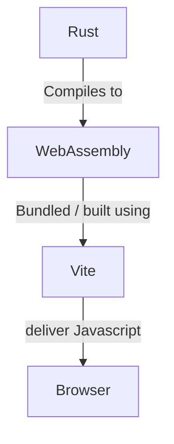

## RSX

## Overview

1. What this project is about
2. The DOM layer
3. Fine-grained reactivity using Rust

## What this project is about.

Disclaimer: This project is not a new library nor a new frontend framework.

It is a study, an archive of my work. Most of this code is from sycamore-rs.

---

At first, I created this project to archive my work/training on Rust procedural macros. The base project was about implementing JSX (a famous syntax in modern frontend frameworks) in Rust, hence the name RSX.

After realizing that a "frontend syntax" had no adequate use in Rust.
I decided to associate it with WebAssembly for a "frontend-related" project.

I already had recreated React and liked deep-diving into this project but I didn't understand many things and had not documented my work like I did for this RSX project/archive.

This project is about recreating and understanding the core of reactive libraries using "fine-grained reactivity" like Sycamore and SolidJS.
For this project, I've "created" 4 libraries:

- rsx: A library that provides types for building UI elements such as components.

- rsx-macros: Rust macros that allow the creation of rsx elements using a JSX-like syntax.

- rsx-reactive: The main reactive library copied from Sycamore source code.

- rsx-web: a library that uses the rsx-reactive library to create reactive UI on the browser.

## The DOM layer

This project is a reactive library built in Rust. Rust will be used to produce WebAssembly that can interact with native JavaScript DOM elements:



## Typical entrypoint

In the Vite example, the program entry point is Rust WASM entry point located in [`src/main.ts`](/examples/vite-example/src/main.ts), this imports and run the built WASM programmed in [`src/lib.rs`](/examples/vite-example/src/lib.rs):

```rust
use wasm_bindgen::prelude::*;

#[wasm_bindgen(start)]
fn start() {
    // ...
}
```

This is where we import the libraries and start developping the interfaces using RSX.

```rust
// Import libraries
use rsx::rsx;
use rsx_web::{console_log, document, node::render_to};
use wasm_bindgen::prelude::*;

// Create component
fn app() -> rsx::Element {
    let onclick = move |_| console_log!("Hello from the WASM side !")

    return rsx!(
        <div class="container">Hello World</div>
    );
}

#[wasm_bindgen(start)]
fn start() {
    let root = document()
        .get_element_by_id("app")
        .expect("#app is undefined");

    render_to(app, &root); // Render the component it to the DOM
}

```
